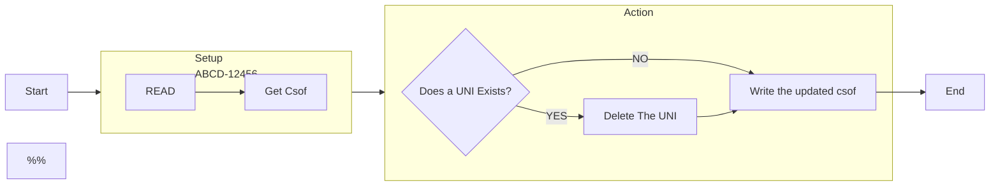

```mermaid
flowchart LR
    START[Start] --> 1[Read From Mongo]
    
    %% Setup Section
    subgraph 1 [Setup<br/>ABCD-12456]
        direction LR
        READ --> GETC[Get Csof]
    end
    
    1 -->  ABC

    %%
    subgraph ABC [Action]
        IS{Does a UNI Exists?} --> |YES| DEL[Delete The UNI]
        IS --> |NO| WRITE[Write the updated csof]
        DEL --> WRITE
    end

    WRITE --> END[End]
```
